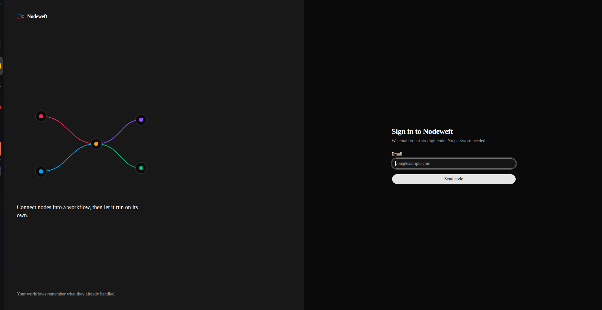
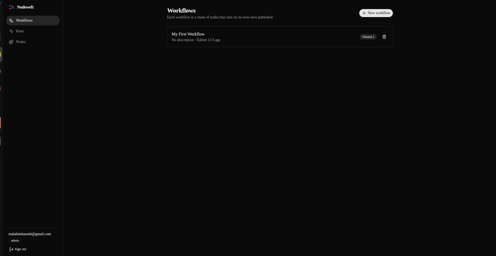
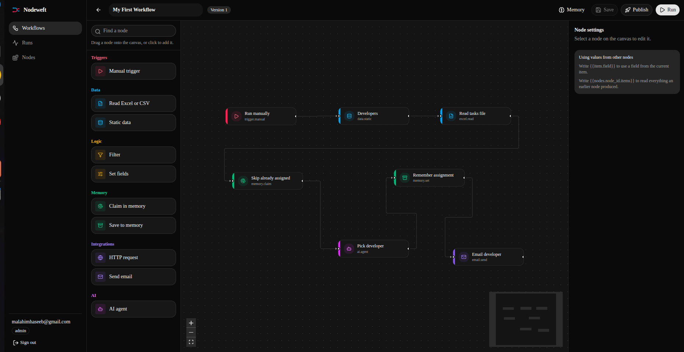
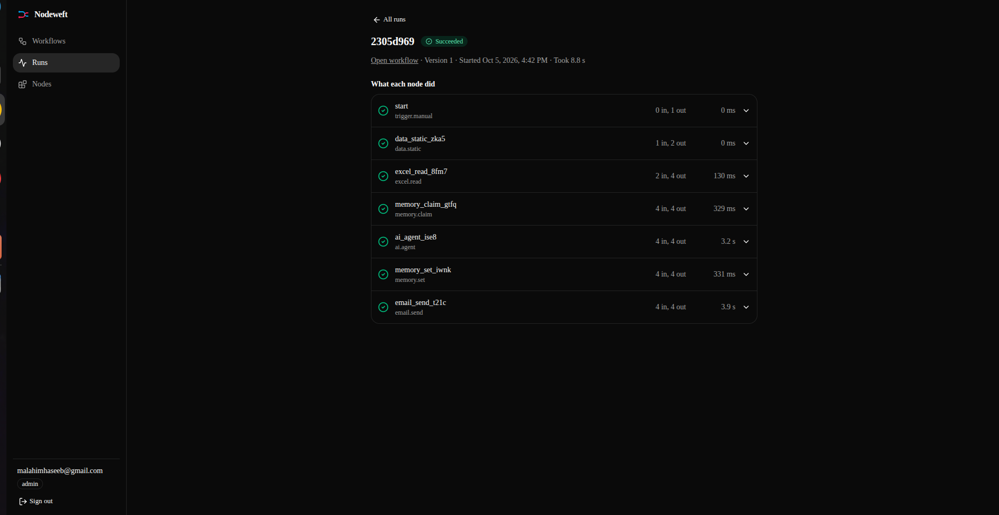

# Nodeweft

A workflow automation platform (n8n-style). Users build node graphs (trigger, data, filter, AI agent, email, HTTP, memory), publish them as versions, and run them. Runs are queued and executed in the background.

**Frontend:** https://nodeweft.malahim.dev

> **How this was built**
> Nodeweft is a vibe coded app. The frontend and backend were built in about **2.5 hours** with AI assistance, and the code was then reviewed by hand over roughly **one day**.

> **Scale**
> The architecture is designed to handle around **1 million requests per day** and to **scale out as traffic grows**. CloudFront, a load balancer, Kubernetes, SQS and Redis are all in place, so capacity grows by adding replicas and nodes. See [Scaling](#scaling).

---
## Screenshots

| Sign in | Dashboard |
|---|---|
|  |  |

| Workflow editor | Run logs |
|---|---|
|  |  |

---


## Architecture

```
Browser (frontend)
        |
   CloudFront           TLS at the edge, optional WAF, secret origin header
        |
   Application Load Balancer     path-based routing, accepts CloudFront only
        |
   Kubernetes (k3s) on EC2
     |- auth       /auth/*, /health              Postgres + Redis
     |- workflow   /workflows, /nodes            MongoDB + Redis
     '- execution  /runs, /workflows/*/memory    Postgres + Redis + SQS + S3
```

| Service | Purpose | Data store |
|---|---|---|
| `auth` | Email OTP login, JWT access tokens, rotating refresh tokens | Postgres |
| `workflow` | Workflow CRUD, validation, versioned publishing, custom nodes | MongoDB |
| `execution` | Runs the node graph: AI agent, memory, email, HTTP, file reads | Postgres |

Shared: **Redis** (rate limiting, OTP state), **SQS** (run queue), **S3** (input files), **ECR** (images), **SSM Parameter Store** (production env files).

Every response uses one envelope: `{ success, message, data, error }`.

---

## Repository layout

```
libs/common/          shared code: config, auth, errors, rate limit, templating, graph, node specs
services/auth/        auth service
services/workflow/    workflow service
services/execution/   execution service (engine, nodes, queue)
deploy/               Terraform, Kubernetes manifests, deploy scripts
scripts/check_env.py  validates the production env files
examples/             sample workflow JSON
data/files/           sample CSV used by the example workflow
```

---

## Run locally

### Prerequisites

- Docker and Docker Compose
- An OpenAI-compatible API key (only for the AI agent node)

### 1. Generate secrets

Three different values, each at least 32 characters:

```bash
openssl rand -hex 32   # JWT_SECRET
openssl rand -hex 32   # INTERNAL_SERVICE_TOKEN
openssl rand -hex 32   # OTP_SECRET
```

### 2. Create `.env`

Local runs use one `.env` file in the repo root, shared by all three services.

```bash
cp .env.example .env
```

Complete local `.env`:

```env
# ---- shared ----
APP_ENV=development
JWT_SECRET=<generated value 1>
INTERNAL_SERVICE_TOKEN=<generated value 2>
CORS_ORIGINS=http://localhost:3000

# ---- auth ----
OTP_SECRET=<generated value 3>
ADMIN_EMAILS=you@example.com
# Leave SMTP empty locally: OTP codes are printed in the auth logs instead.
SMTP_HOST=
SMTP_PORT=587
SMTP_USER=
SMTP_PASSWORD=
SMTP_FROM=

# ---- workflow ----
MONGO_DB_NAME=nodeweft_workflows

# ---- execution ----
RUN_QUEUE_BACKEND=local
OPENAI_API_KEY=<your key>
OPENAI_BASE_URL=https://api.openai.com/v1
OPENAI_MODEL=gpt-4o-mini
```

`docker-compose.yml` already sets `DATABASE_URL`, `REDIS_URL`, `MONGO_URL`, `WORKFLOW_SERVICE_URL`, `ALLOW_LOCAL_FILES` and `LOCAL_FILES_DIR` for the local containers, so do not put them in `.env`.

With `APP_ENV=development`, Swagger docs are on and emails are logged instead of sent.

### 3. Start everything

```bash
docker compose up --build
```

| Service | URL | Docs |
|---|---|---|
| auth | http://localhost:8001 | http://localhost:8001/docs |
| workflow | http://localhost:8002 | http://localhost:8002/docs |
| execution | http://localhost:8003 | http://localhost:8003/docs |

### 4. Sign in

```bash
curl -X POST http://localhost:8001/auth/request-otp \
  -H "Content-Type: application/json" -d '{"email":"you@example.com"}'

docker compose logs auth | grep OTP      # the code is printed here

curl -X POST http://localhost:8001/auth/verify-otp \
  -H "Content-Type: application/json" -d '{"email":"you@example.com","code":"123456"}'
```

The response holds an `access_token` (15 minutes) and a `refresh_token` (14 days). Send `Authorization: Bearer <access_token>` on every other call.

### 5. Try the example workflow

`examples/task_assignment_workflow.json` reads `data/files/tasks.csv`, asks an AI agent to pick a developer, remembers the assignment, and emails them. It needs the `OPENAI_*` variables.

```bash
curl -X POST http://localhost:8002/workflows \
  -H "Authorization: Bearer <token>" -H "Content-Type: application/json" \
  -d "{\"name\":\"Task assignment\",\"graph\":$(cat examples/task_assignment_workflow.json)}"
```

Publish it with `POST /workflows/{id}/publish`, then run it with `POST /runs` and `{"workflow_id": "<id>"}`.

### 6. Run the tests

```bash
docker compose -f docker-compose.test.yml run --rm tests
```

---

## Environment variables

Production uses three files in the repo root: `auth.env`, `workflow.env` and `execution.env`. Copy the templates below, fill in the values, then validate them:

```bash
python3 scripts/check_env.py .
```

The checker prints problems and never prints secret values.

**Rules that apply across the files**

- `JWT_SECRET`, `INTERNAL_SERVICE_TOKEN` and `REDIS_URL` must be **identical** in all three files.
- `JWT_SECRET`, `INTERNAL_SERVICE_TOKEN` and `OTP_SECRET` must all be **different** from each other and at least 32 characters.
- Redis URL must start with `rediss://` (TLS).
- Postgres URL must start with `postgresql+asyncpg://`, include `?ssl=require`, and use the direct host (no `-pooler`).
- `auth.env` points at database `auth_db`, `execution.env` at `execution_db`.

### `auth.env`

```env
APP_ENV=production
JWT_SECRET=<64 hex chars>
INTERNAL_SERVICE_TOKEN=<64 hex chars>
OTP_SECRET=<64 hex chars>
ADMIN_EMAILS=you@example.com
REDIS_URL=rediss://default:<password>@<redis-host>:6379/0
DATABASE_URL=postgresql+asyncpg://<user>:<password>@<postgres-host>/auth_db?ssl=require

SMTP_HOST=smtp.gmail.com
SMTP_PORT=587
SMTP_USER=you@gmail.com
SMTP_PASSWORD=<16-character app password>
SMTP_FROM=Nodeweft <you@gmail.com>
```

### `workflow.env`

```env
APP_ENV=production
JWT_SECRET=<same as auth.env>
INTERNAL_SERVICE_TOKEN=<same as auth.env>
REDIS_URL=<same as auth.env>
MONGO_URL=mongodb+srv://<user>:<password>@<cluster>.mongodb.net/?retryWrites=true&w=majority
MONGO_DB_NAME=nodeweft_workflows
```

### `execution.env`

```env
APP_ENV=production
JWT_SECRET=<same as auth.env>
INTERNAL_SERVICE_TOKEN=<same as auth.env>
REDIS_URL=<same as auth.env>
DATABASE_URL=postgresql+asyncpg://<user>:<password>@<postgres-host>/execution_db?ssl=require
WORKFLOW_SERVICE_URL=http://workflow:8000

RUN_QUEUE_BACKEND=sqs
SQS_QUEUE_URL=https://sqs.eu-west-1.amazonaws.com/<account-id>/<queue-name>
AWS_REGION=eu-west-1
S3_BUCKET=<files-bucket-name>

# Needed by check_env.py. make-prod-env.sh removes them from the production
# copy, because the server uses its IAM role instead of keys.
AWS_ACCESS_KEY_ID=<key>
AWS_SECRET_ACCESS_KEY=<secret>

OPENAI_API_KEY=<key>
OPENAI_BASE_URL=https://api.openai.com/v1
OPENAI_MODEL=gpt-4o-mini

SMTP_HOST=smtp.gmail.com
SMTP_PORT=587
SMTP_USER=you@gmail.com
SMTP_PASSWORD=<16-character app password>
SMTP_FROM=Nodeweft <you@gmail.com>
EMAIL_ALLOWED_DOMAINS=yourcompany.com
```

`EMAIL_ALLOWED_DOMAINS` is **required in production when `SMTP_HOST` is set**. The execution service refuses to start without it.

### Variables added by `make-prod-env.sh`

You do not write these yourself. The script sets them in each `*.prod.env`:

| Variable | Value |
|---|---|
| `APP_ENV` | `production` |
| `TRUSTED_PROXY_HOPS` | `2` (CloudFront + load balancer) |
| `CORS_ORIGINS` | the frontend URL you pass to the script |
| `ALLOW_LOCAL_FILES` | `false` (execution only) |

### Optional tuning variables

All have defaults. Add them to a file only when you want to change them.

| Variable | Default | Service | Meaning |
|---|---|---|---|
| `ACCESS_TOKEN_MINUTES` | `15` | all | Access token lifetime |
| `MAX_BODY_BYTES` | `2000000` | all | Max request body |
| `REFRESH_TOKEN_DAYS` | `14` | auth | Refresh token lifetime |
| `OTP_TTL_SECONDS` | `300` | auth | OTP validity |
| `OTP_MAX_ATTEMPTS` | `5` | auth | Wrong-code attempts per code |
| `OTP_RESEND_COOLDOWN_SECONDS` | `60` | auth | Delay between OTP requests |
| `OTP_HOURLY_LIMIT` | `5` | auth | OTP emails per address per hour |
| `RUN_TIMEOUT_SECONDS` | `900` | execution | Max duration of a run |
| `NODE_TIMEOUT_SECONDS` | `120` | execution | Max duration of one node |
| `MAX_ITEMS_PER_NODE` | `5000` | execution | Items one node may produce |
| `MAX_AI_ITEMS_PER_RUN` | `200` | execution | Items an AI node may process |
| `MAX_EMAILS_PER_RUN` | `200` | execution | Emails one run may send |
| `MAX_FILE_BYTES` | `10000000` | execution | Max input file size |
| `HTTP_ALLOWED_HOSTS` | empty | execution | Allowlist for the HTTP node |
| `CLAIM_STALE_MINUTES` | `30` | execution | When a pending memory claim expires |

---

## Deploy to AWS

**Prerequisites:** AWS CLI, Docker, Terraform 1.6 or newer, two issued ACM certificates (one in the load balancer region, one in `us-east-1` for CloudFront), an S3 files bucket, an SQS queue, and Postgres, MongoDB and Redis instances.

Use a dedicated IAM user for deployment, not the app's credentials:

```bash
aws configure --profile nodeweft-deployer
export AWS_PROFILE=nodeweft-deployer
```

### 1. Create the infrastructure

```bash
cp deploy/terraform/terraform.tfvars.example deploy/terraform/terraform.tfvars
# edit terraform.tfvars with your domains, certificate ARNs, bucket and queue

terraform -chdir=deploy/terraform init
terraform -chdir=deploy/terraform plan
terraform -chdir=deploy/terraform apply
```

`terraform.tfvars`:

```hcl
region                     = "eu-west-1"
alb_domain                 = "origin.example.com"
cdn_domain                 = "api.example.com"
alb_certificate_arn        = "arn:aws:acm:eu-west-1:<account-id>:certificate/<id>"
cloudfront_certificate_arn = "arn:aws:acm:us-east-1:<account-id>:certificate/<id>"
files_bucket_name          = "<files-bucket-name>"
sqs_queue_arn              = "arn:aws:sqs:eu-west-1:<account-id>:<queue-name>"
instance_type              = "t3.medium"
enable_waf                 = false
```

### 2. Network and DNS

- Add the printed `public_ip` to your MongoDB Atlas network access list.
- Create two CNAME records at your DNS provider:

| Host | Points to |
|---|---|
| the `alb_domain` host | the `alb_dns_name` output |
| the `cdn_domain` host | the `cloudfront_domain_name` output |

### 3. Create the production env files

Create `auth.env`, `workflow.env` and `execution.env` from the templates above, then:

```bash
python3 scripts/check_env.py .
deploy/scripts/make-prod-env.sh https://nodeweft.malahim.dev
```

### 4. Deploy

```bash
deploy/scripts/deploy.sh
curl https://<your-api-domain>/health
```

The script builds and pushes the three images, stores the env files in SSM Parameter Store (encrypted), uploads the manifests, and rolls out the pods.

To change the frontend origin later, rerun `make-prod-env.sh` with the new URL, then `deploy.sh`.

---

## API overview

| Area | Endpoints |
|---|---|
| Auth | `POST /auth/request-otp`, `POST /auth/verify-otp`, `POST /auth/refresh`, `POST /auth/logout`, `GET /auth/me` |
| Nodes | `GET /nodes`, `POST /nodes/custom` (admin), `DELETE /nodes/custom/{key}` (admin) |
| Workflows | `GET/POST /workflows`, `GET/PUT/DELETE /workflows/{id}`, `POST /workflows/{id}/publish`, `GET /workflows/{id}/versions` |
| Runs | `POST /runs`, `GET /runs`, `GET /runs/{id}`, `GET /runs/{id}/logs` |
| Memory | `GET /workflows/{id}/memory`, `DELETE /workflows/{id}/memory` |

Send `Authorization: Bearer <access_token>` on everything except the `/auth/*` login routes. When a call returns `401`, call `/auth/refresh` and retry.

---

## Security

- Passwordless email OTP: codes are HMAC-hashed, rate limited, attempt limited, and single use.
- Refresh tokens rotate, and reuse of an old one revokes the whole token family.
- The origin accepts traffic only from CloudFront (security group prefix list plus a secret header checked at the load balancer).
- The HTTP node blocks private, loopback and link-local addresses and does not follow redirects.
- Email recipients are validated against header injection, with a domain allowlist and per-run caps.
- Production env files live in SSM Parameter Store as encrypted SecureString values. Pods run as non-root with all capabilities dropped.
- Never commit `*.env`, `*.prod.env`, `terraform.tfstate` or `terraform.tfvars`. The `.gitignore` already excludes them.

---

## Scaling

The deployment is built to grow with traffic. Each step below raises capacity without redesigning anything:

1. **More replicas.** Raise `replicas` in `deploy/k8s/*.yaml`. Execution replicas run independent workers, because runs are claimed atomically and SQS delivers each message once.
2. **Bigger node.** Change `instance_type` in `terraform.tfvars` (for example `t3.large`) and run `terraform apply`.
3. **Edge protection.** Set `enable_waf = true` for per-IP rate limiting at CloudFront.
4. **More nodes.** Add EC2 nodes to the cluster and attach them to the load balancer target groups.
5. **Managed tiers.** Move MongoDB, Postgres and Redis to larger plans as load increases.
6. **Autoscaling.** Move to an Auto Scaling Group or EKS/ECS and scale execution pods on SQS queue depth.
7. **Email.** Use Amazon SES for high-volume OTP and workflow email.
